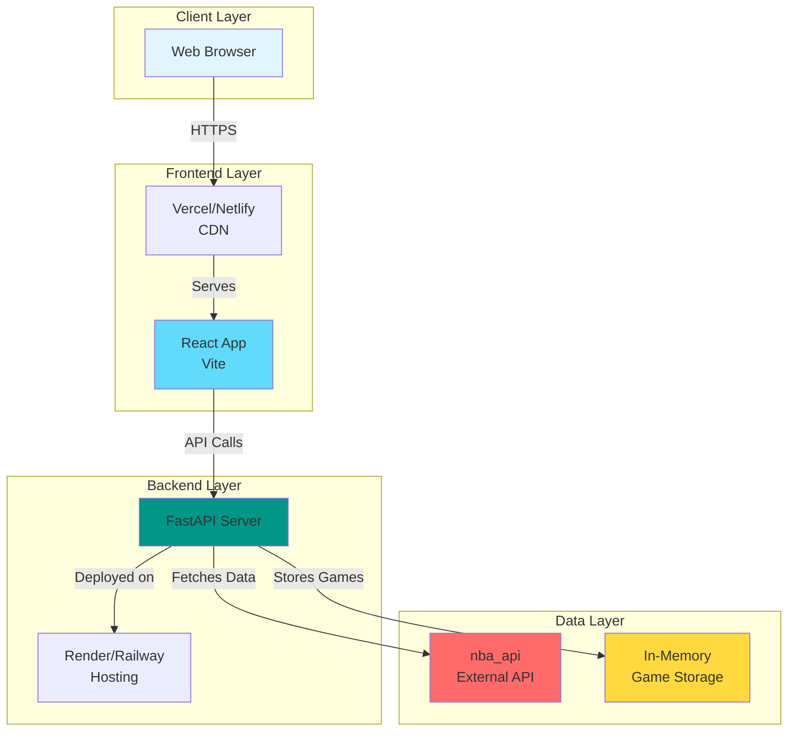

# NBA Wordle - Architecture Diagram

## System Architecture



## Component Architecture

```
┌─────────────────────────────────────────────────────────────┐
│                        Frontend (React)                      │
├─────────────────────────────────────────────────────────────┤
│                                                             │
│  ┌──────────────┐  ┌──────────────┐  ┌──────────────┐     │
│  │   App.jsx    │  │  Search      │  │  Guess       │     │
│  │              │  │  Component   │  │  Component   │     │
│  │  - State     │  │              │  │              │     │
│  │  - Effects   │  │  - Autocomplete│ │  - Feedback │     │
│  │  - Handlers  │  │  - Results   │  │  - Display  │     │
│  └──────────────┘  └──────────────┘  └──────────────┘     │
│                                                             │
└─────────────────────────────────────────────────────────────┘
                            │
                            │ HTTP/REST
                            │
┌─────────────────────────────────────────────────────────────┐
│                    Backend (FastAPI)                         │
├─────────────────────────────────────────────────────────────┤
│                                                             │
│  ┌──────────────┐  ┌──────────────┐  ┌──────────────┐     │
│  │  Routes      │  │  Services    │  │  Engine      │     │
│  │              │  │              │  │              │     │
│  │  - /start    │  │  - NBA Data  │  │  - Comparison│     │
│  │  - /guess    │  │  - Player    │  │  - Logic     │     │
│  │  - /search   │  │  - Stats     │  │  - State     │     │
│  └──────────────┘  └──────────────┘  └──────────────┘     │
│                                                             │
└─────────────────────────────────────────────────────────────┘
                            │
                            │ HTTP
                            │
┌─────────────────────────────────────────────────────────────┐
│                    External Services                        │
├─────────────────────────────────────────────────────────────┤
│                                                             │
│  ┌──────────────┐                                          │
│  │  nba_api     │                                          │
│  │              │                                          │
│  │  - Players   │                                          │
│  │  - Stats     │                                          │
│  │  - Teams     │                                          │
│  └──────────────┘                                          │
│                                                             │
└─────────────────────────────────────────────────────────────┘
```

## Data Flow Sequence

### Game Start Flow

```
User → Frontend → POST /api/start-game
                      ↓
                  Backend Routes
                      ↓
                  NBA Data Service
                      ↓
                  Get Random Player
                      ↓
                  Create Wordle Engine
                      ↓
                  Store Game (Memory)
                      ↓
                  Return game_id
                      ↓
                  Frontend stores game_id
```

### Guess Flow

```
User selects player → Frontend → POST /api/guess
                                      ↓
                                  Backend Routes
                                      ↓
                                  Get Game Engine
                                      ↓
                                  NBA Data Service
                                      ↓
                                  Get Player Details
                                      ↓
                                  Wordle Engine
                                      ↓
                                  Compare Attributes
                                      ↓
                                  Update Game State
                                      ↓
                                  Return Comparison
                                      ↓
                                  Frontend displays feedback
```

## Comparison Logic Flow

```
Wordle Engine
    │
    ├── Check Duplicate Guess
    │   └── Already guessed? → Error
    │
    ├── Compare Team
    │   ├── Exact match? → ✅ correct
    │   └── No match → ❌ incorrect
    │
    ├── Compare Division
    │   ├── Exact match? → ✅ correct
    │   └── No match → ❌ incorrect
    │
    ├── Compare Conference
    │   ├── Exact match? → ✅ correct
    │   └── No match → ❌ incorrect
    │
    ├── Compare Age
    │   ├── Exact match? → ✅ correct
    │   ├── Guessed < Target? → ⬆️ higher
    │   └── Guessed > Target? → ⬇️ lower
    │
    ├── Compare Height
    │   ├── Exact match? → ✅ correct
    │   ├── Guessed < Target? → ⬆️ higher
    │   └── Guessed > Target? → ⬇️ lower
    │
    ├── Compare Position
    │   ├── Exact match? → ✅ correct
    │   ├── Same group? → 🟨 partial
    │   └── Different group? → ❌ incorrect
    │
    ├── Compare Jersey
    │   ├── Exact match? → ✅ correct
    │   ├── Guessed < Target? → ⬆️ higher
    │   └── Guessed > Target? → ⬇️ lower
    │
    └── Compare PPG
        ├── Exact match? → ✅ correct
        ├── Guessed < Target? → ⬆️ higher
        └── Guessed > Target? → ⬇️ lower
```

## Deployment Architecture

```
┌─────────────────────────────────────────────────────────────┐
│                      Production Setup                        │
├─────────────────────────────────────────────────────────────┤
│                                                             │
│  ┌──────────────────┐         ┌──────────────────┐         │
│  │   Frontend       │         │    Backend       │         │
│  │                  │         │                  │         │
│  │  Vercel/Netlify  │────────▶│  Render/Railway  │         │
│  │                  │  HTTPS  │                  │         │
│  │  - CDN           │         │  - Python Server │         │
│  │  - Auto Deploy   │         │  - Auto Deploy   │         │
│  │  - SSL           │         │  - SSL           │         │
│  └──────────────────┘         └──────────────────┘         │
│                                                             │
└─────────────────────────────────────────────────────────────┘
```

## State Management

### Backend State

```
games: {
    "game-id-1": WordleEngine {
        target_player: {...},
        season: "2025-26",
        guesses: [...],
        max_guesses: 8
    },
    "game-id-2": WordleEngine {...}
}
```

### Frontend State

```javascript
{
    gameId: string,
    guesses: Array<GuessResult>,  // Includes player images
    isGameOver: boolean,
    isWon: boolean,
    searchQuery: string,
    searchResults: Array<Player>,  // Includes images
    selectedPlayer: Player | null
}
```

## Error Handling Flow

```
Request → Route Handler
    │
    ├── Success → Return Response
    │
    └── Error → Exception Handler
        │
        ├── 400 Bad Request → Return Error Message
        ├── 404 Not Found → Return Error Message
        └── 500 Server Error → Log & Return Generic Error
```

## Security Layers

```
┌─────────────────────────────────────┐
│  CORS Middleware                     │
│  - Allow frontend origin             │
│  - Allow required methods            │
└─────────────────────────────────────┘
            ↓
┌─────────────────────────────────────┐
│  Input Validation                    │
│  - Pydantic models                   │
│  - Type checking                     │
└─────────────────────────────────────┘
            ↓
┌─────────────────────────────────────┐
│  Business Logic                      │
│  - Game state validation             │
│  - Player ID validation              │
└─────────────────────────────────────┘
```

## Performance Optimizations

1. **Caching**: Player lists and team data cached in memory (per season)
2. **Async Operations**: FastAPI async endpoints for I/O operations
3. **CDN**: Frontend served via CDN (Vercel/Netlify)
4. **Image Loading**: Player images loaded from NBA.com CDN with error handling
5. **Request Batching**: Player search results limited to reduce payload
6. **Duplicate Prevention**: Prevents unnecessary API calls for same player

## Scalability Considerations

### Current (MVP)
- Single server instance
- In-memory game storage
- Hardcoded to 2025-26 season
- Player images from NBA.com CDN
- Suitable for low-medium traffic

### Future Enhancements
- Redis for game storage (distributed)
- Database for persistence (PostgreSQL)
- Load balancing for multiple instances
- Caching layer (Redis) for NBA data
- Rate limiting per user/IP
- Season selection (currently hardcoded to 2025-26)
